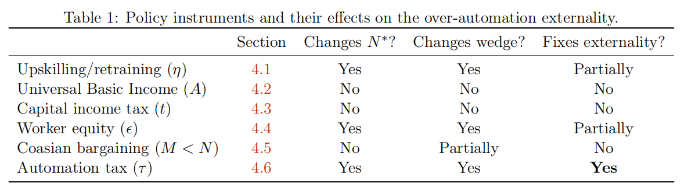
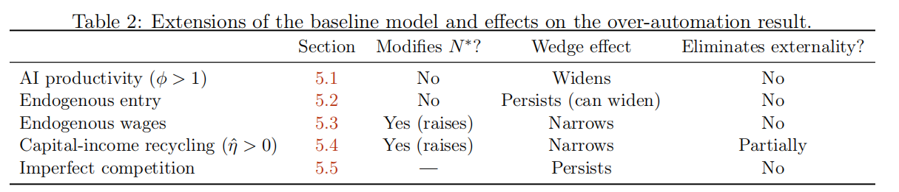

# The AI Layoff Trap

[论文链接](https://arxiv.org/abs/2603.20617)

## 引入&简介

AI 时代的到来使生产力大幅发展，同时也引发了社会性担忧：AI 是否会过度取代人类劳动力，导致大规模失业？ 

《The AI Layoff Trap》站在企业竞争的立场，建立了一个简明的模型。研究揭示了企业引入 AI 的行为往往是**过度**的，因为自动化带来的“需求损失”具有强烈的**负外部性**，由全行业共同分担，而并非由决策企业独自承担。
作者将“纳什均衡下的自动化率”与“企业集体最优下的自动化率”之间的差距定义为**过度自动化楔子**。文章评估了多种政策手段，得出结论：*只有庇古税能从根本上纠正这一外部性*。

>个人观点：这篇文章的建模是十分简单的，整篇文章都在说明一件事——引入自动化会导致裁员，而裁员带来的需求损失会由所有的企业平摊，因此任何手段，只要你不能解决这个“负外部性”，就不能根除这个问题。

## 基本模型与均衡结果

>个人观点： 其实这个问题本质上就是一个公地悲剧，接下来我们就会看到。

### 1. 企业设定
假设市场上存在 $N$ 家完全对称的企业，每家企业拥有 $L$ 个任务头寸 。企业需决定自动化率 $\alpha_i \in [0,1]$：

* 任务 $z \in [0, \alpha_i]$ 由 AI 完成，单位成本为 $c$ 。

* 任务 $z \in (\alpha_i, 1]$ 由工人完成，单位工资为 $w$（且 $0 < c < w$） 。

* 引入 AI 会产生二次项的磨合成本$\frac{k}{2} L \alpha_i^2$ 。

单家企业的生产费用函数：
$$
C_i(\alpha_i) = L(\alpha_i c + (1 - \alpha_i)w) + \frac{k}{2} L \alpha_i^2
$$ 

若令 $s = w - c$ 代表自动化带来的单任务成本节省，则成本可改写为：
$$
C_i = L(w - s \alpha_i) + \frac{k}{2} L \alpha_i^2
$$ 

### 2. 需求侧
社会总需求由基础需求 $A$ 和工人的二次消费组成：

* 工人的**边际消费倾向（MPC）**为 $\lambda \in (0, 1]$。

* 失业工人通过再就业或转移支付可恢复 $\eta$ 比例的收入，因此每失业一人，该行业损失 $(1-\eta)w$ 的收入。

**定义单位任务的需求损失 $\ell$：**

$$
\ell := \lambda (1 - \eta) w
$$

**市场总需求 $D$ 为：**
$D(\boldsymbol{\alpha}) = A + \lambda w L N - \ell L N \bar{\alpha}$
其中 $\bar{\alpha}$ 为所有企业的平均自动化率。

### 3. 企业利润
在完全竞争定价下，单家企业的收入为 $\text{Rev}_i = D / N$。结合成本函数，企业 $i$ 的利润函数可写为：

$$
\pi_i = \Pi_0 + L \left( s \alpha_i - \ell \bar{\alpha} - \frac{k}{2} \alpha_i^2 \right)
$$

为了研究纳什均衡，我们将自身决策与对手策略分离：

$$
\pi_i = \Pi_0 + L \left[ \alpha_i \left( s - \frac{\ell}{N} \right) - \frac{k}{2} \alpha_i^2 - \frac{\ell}{N} \sum_{j \neq i} \alpha_j \right]
$$

> **个人见解：**  这样做其实就是为了后续求一阶导就能直接找到最优解。

### 4. 目标函数
作者通过线性加权定义了社会总福利 $S$，其中 $\mu$ 为工人的权重：
$S(\mu) = \mu \mathcal{W} + (1 - \mu) \mathcal{K}$
其中 $\mathcal{W}$ 为工人总收入，$\mathcal{K}$ 为全行业总利润。即使在 $\mu = 0$（仅关注企业利润）的情况下，由于外部性的存在，纳什均衡下的自动化率依然会显著高于集体最优水平。

### 5. 均衡求解

我们对企业收益求一阶导，得到：

$$
\frac{\partial \pi_i}{\partial \alpha_i} = L \left( s - \frac{\ell}{N} - k \alpha_i \right)
$$

> **个人见解：** 这里其实揭示了文章的核心，需求损失l被N分摊了，所以企业选择$\alpha$的时候总是会过大，即“竞争市场使个人选择相较于集体最优产生了扭曲”。

下面我们会给出最重要的一个proposition: 
现在定义自动化阈值为：

$$
N^* := \frac{\ell}{s} = \frac{\lambda(1-\eta)w}{w-c} 
$$

* 如果 $N \le N^*$，则没有企业进行自动化（$\alpha^{NE} = 0$）。
* 如果 $N > N^*$（等价于 $s > \ell/N$）：
    * (i) 每家企业的严格占优策略（strictly dominant strategy）为：

        $$
        \alpha^{NE} = \min((s - \ell/N)/k, 1)
        $$
    * (ii) 合作最优解（cooperative optimum）为：

        $$
        \alpha^{CO} = \min(\max(0, (s - \ell)/k), 1)
        $$
    * (iii) 如果 $\ell < s < k + \ell/N$，那么 $\alpha^{NE}$ 和 $\alpha^{CO}$ 均为内点解（interior），且过度自动化楔子（over-automation wedge）为：
    
        $$
        \alpha^{NE} - \alpha^{CO} = \frac{\ell(1 - 1/N)}{k} > 0
        $$
        该值随 $N$ 和 $\ell$ 严格递增，随 $k$ 严格递减。
    * (iv) 如果 $s \le \ell$，则 $\alpha^{CO} = 0$，此时楔子即为 $\alpha^{NE}$：
        * 若 $s < k + \ell/N$，则 $\alpha^{NE} = (s - \ell/N)/k$，故楔子为 $(s - \ell/N)/k$。
        * 若 $k + \ell/N \le s$，则 $\alpha^{NE} = 1$，故楔子为 1。

> **个人见解：**  所谓楔子的概念非常类似博弈论里面的“Price of Anarchy”,指的都是个人选择自己的最优解会使社会的行为偏离总体的最优解。在本文中实际上所有偏移都是因为企业感受到的需求损失与社会的总需求损失是不一致的。事实上，整篇文章的所有结论都建立在这一点上，反而是那些边界细节我们不需要关心。

这一节的后续讨论相对琐碎，简单概括就是:

 *  企业之间的cheaptalk是没有办法降低自动化率的，因为这是一个囚徒困境，偏移总是可以获利。

 * 即使采用前面提到的线性的目标函数（考虑企业和工人福利加权），楔子依然存在，只是略有调整，毕竟产生楔子的根源没有改变。

## 政策解决手段及效果

> **个人见解：** 文章中提到了大量手段——其中很多都是无效的，实际上，我们唯一需要把握的就是其是否能够解决外部性问题。

我将对这部分进行大幅简化并通俗易懂地说说“为什么”，以下是原文的总结图：

### 1. 技能提升与再培训 

- **核心逻辑**：本质上是试图通过提高工人的再就业能力，影响需求损失参数 $\ell = \lambda(1-\eta)w$ 中的收入替代率 $\eta$。
- **效果**：作者证明提高 $\eta$ 确实能缩小“楔子”（Wedge），因为这缓解了由于失业导致的需求侧坍塌。
- **局限性**：只要 $\eta < 1$（即失业工人无法 100% 恢复原有收入水平），外部性就依然存在，无法从根本上消除过度自动化的动力。

### 2. 全民基本收入 

- **核心逻辑**：这是一种无条件的转移支付。在模型中，它表现为增加了自主需求 $A$。
- **效果**：由于就业工人和被替代工人都收到相同的款项，它只改变了利润的绝对水平，而没有改变自动化的边际收益。
- **结论**：UBI 提高了生活保障的底线，但对企业竞相引入 AI 的纳什均衡行为毫无影响。

### 3. 资本所得税 

- **核心逻辑**：对企业总收益按比例 $t$ 征税，并将税收返还给社会。
- **效果**：由于利润函数被整体缩放为 $(1-t) \pi_i$，在求解最优化条件时，$(1-t)$ 会被约掉。
- **结论**：它改变的是利润水平而非边际诱因。这种税收往往与“机器人税”混淆，但它无法纠正自动化带来的外部性。

### 4. 工人股权参与 

- **核心逻辑**：企业将利润的 $\epsilon$ 比例分给工人，由此形成一个反馈闭环（不动点问题）：
  $$D = A + \lambda \left[ \text{wage income} + \epsilon \sum\nolimits_{i} \pi_i \right]$$
   其中 $\sum_i \pi_i = D - \sum_i C_i$
- **效果**：当工人持有股权时，裁员损失的一部分会通过利润分红回流到需求侧。这会增加企业感知到的自动化代价，从而缩小楔子。
- **局限性**：由于需求存在向竞争对手“泄漏”的问题，除非 $\lambda \epsilon = 1$（这在现实中极难实现），否则无法根除外部性。

> 此外，作者证明企业并不会主动进行这种分红。

### 5. 科斯谈判 

- **核心逻辑**：被裁员的工人通过谈判获得遣散费 $\sigma$。这在操作上等同于提高了收入替代率 $\eta$。
- **结论**：虽然增加了部分需求，但由于外部性是跨企业、跨产品市场的（Firm-to-firm），单家企业的内部谈判无法触及流失到对手那里的购买力，因此无法消除楔子。

### 6. 庇古税

- **核心逻辑**：针对每单位自动化任务征收特定税额 $\tau^*$，使企业的私人诱因与社会成本对齐。
- **最优税率**：
  $$\tau^* = \ell \left( 1 - \frac{1}{N} \right)$$
- **效果**：该税额精准地抵消了企业进行自动化时，除了自身承担的那部分损失外，强加给全社会的“负外部性”。

> **个人见解** ：其实就是恰好征收掉企业进行一单位的自动化给除了自己外整个社会需求的负外部性。

## 模型参数变化影响

> **个人见解** ：其实我们仍然只用把握是否改变需求的外部性就可以解决问题,因为其他手段都是隔靴搔痒。

作者给出了若干参数变化导致的结果：

**市场竞争程度 ($N$)**：竞争越激烈（$N$ 越大），过度自动化的楔子就越宽。因为随着企业数量增加，每家企业感知到的“自己对市场的破坏”仅占 $1/N$，分摊越薄，克制动机就越弱。

**AI 生产力水平 ($\phi$)**：AI 越先进、产出越高，楔子反而越宽。这被称为“红皇后效应”：每家企业都想靠更高产的 AI 抢占对手份额，但均衡时大家同步加强导致份额并没变，结果只是集体加速了对需求的破坏。

**工资内生调整 ($w$)**：虽然失业会导致工资下降，进而降低自动化省钱的诱惑（自矫正机制），但这只能推迟问题爆发的时间，而不能消除楔子。一旦跨过阈值，这种结构性的过度行为依然会存在。

**资本收益回流 ($\hat{\eta}$)**：如果企业主把利润也花在行业内，确实能缩小楔子，但在现实参数下很难完全闭合。因为这种回流本质上还是无法解决跨企业的需求稀释问题。

**集成磨合成本 ($k$)**：磨合成本越高，楔子越窄。因为物理层面的“阻力”限制了企业自动化的速度，从侧面起到了抑制过度博弈的作用。