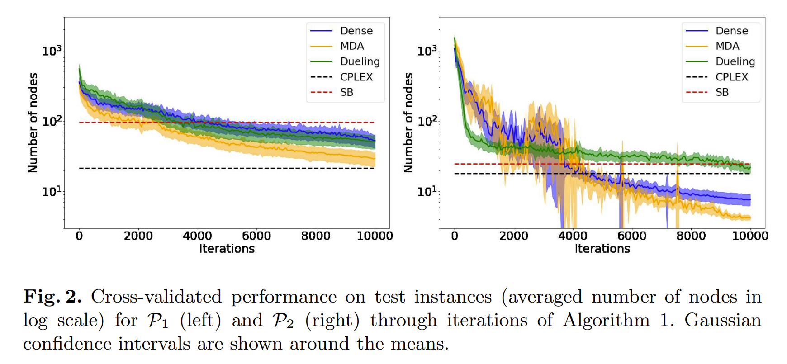

# Reinforcement Learning for Variable Selection in a Branch and Bound Algorithm (20)

我们可以认为这是B&B与RL开始的起点

## 前言

区别于以往的IL或者其他启发式选择分支变量的方法，RL实际上聚焦于从0开始学习如何对分支变量进行选择（事实上也可以在已有参数上不从0开始，会收敛更快）。总之，很重要的一点是，不同MILP问题是由不同**特征**的，因此不同类问题P相当于从不同分布$D$当中抽样（电力、某些背包都相当于从不同D中抽样），标准形式即：
$$
p \in \mathcal{P}:
\begin{cases}
\min\limits_{x \in \mathbb{R}^n} \; c^\top x \\\
\text{s.t.} 
& Ax \le b, \\\
& x_J \in \{0,1\}^{|J|}, \\\
& x_{-J} \in \mathbb{R}^{\,n-|J|}.
\end{cases}
$$

>本论文的创新点在于“第一次”用ML做分支变量选择，考虑到的分支变量选择的全局性（i.e.给定目前全局的所有信息，然后选择分支变量），目标即最小化B&B树的规模。

## MDP建模（简略版）

### 动作，状态，策略

显然，动作集合A就是选择分支变量的集合,i.e $A=\mathcal{J}$ ,其中 $J=\{ var_1,var_2,...,var_j\}$ 。

状态集合定义得非常trivial,即包含了到执行分支变量选择时的所有信息，包括到目前为止的变量、节点选择，上下界，树的形状等等...客观上非常全面，但也埋下了状态爆炸的雷。

$$
\pi :
\begin{cases}
S \to A, \\
s \mapsto \pi(s) = a.
\end{cases}
$$

上述策略是**确定性**策略，意味着在策略 $\pi$下给定s输出唯一（我觉得可能直接采用softmax后最高的那个）。

### 目标函数 

我们称 $\Pi$为有$\pi$ 诱导的执行器，$\Pi(p)$即在实例p上的执行结果，$\mu(\Pi(p))$就是我们在某个指标上测评执行结果，我们的实例是从分布D当中抽取的，所以目标函数显然：

$$
\Pi^\ast \in \arg\min_{\Pi}
\mathbb{E}_{p \sim \mathcal{D}} \left[ \mu(\Pi(p)) \right]
$$

### 动作价值函数 

动作价值函数即给定s,a,此后按照$\pi$完全行事所产生的价值，于是状态价值就可以表示为$\pi(s) = \arg\min_{a \in A} Q^\pi(s, a).$，我们需要训练的神经网络即给定状态时能找到最优的动作，换句话说我们要评价此时哪个 $a \in A$最好，可以估计为 $\hat{Q}(s, a; \theta)$ ，最优动作即 $\pi_\theta(s) = \arg\min_{a \in A} \hat{Q}(s, a; \theta)$

$$
L(\theta) = \mathbb{E}_{s,a \sim \rho(\cdot)} \big[ Q^{\pi_\theta}(s, a) - \hat{Q}(s, a; \theta) \big]^2
$$

作者简单采用平方损失，注意到Q是可计算的，因此如果$\hat{Q}$ 真能准确地推测Q-value那张表，那么误差就能够减小到0。

### 目标函数选取

目标函数自然选择为最小化树的规模，那么动作价值函数就可以定义为给定状态s和动作a下，接下来按照策略 $\pi$ 所导致的树的大小。

但诡异之处在于，我们在B&B里面并不只有变量分支这一步啊，实际上还有节点选择。 这与强化学习中不同的是，即使给定了$\pi$,当我们采用不同的节点选择策略时，得到的树也不是唯一的(and 结果也会很不同)。因此作者给出两个proposition:

1. 一般来说，在分支定界（B&B）树中，最小化任意节点下的子树规模，并不能保证全局搜索树的总规模最优。

2. 当采用深度优先搜索作为节点选择策略时，若每个子树的规模均达到最小，则整棵分支定界（B&B）树的规模也达到最小。

*这就体现了节点选择方法不同的话，子树的规模是可变的（因为涉及剪枝），深度优先搜索应该是保证了走一条路一定要走到头*

> 证明：首先，我们假设活动节点为$o \in O$(规模为k),关闭节点为$c \in C$(规模为m), 我们记 $V^{\pi}(s|\zeta,\eta)$是以s为根的子树规模，那么该规模完全由以下三者决定：

 1. 该子树所采用的分支策略$\pi$
 2. 其他子树当中发现的原始上界
 
  $$ \zeta= (\zeta_{c1} \cup \zeta_{c2} \cup ...\cup \zeta_{cm} )\bigcup_{j < i} \zeta_j
  $$

 3. 节点选择策略 $\zeta$

我们假设开放的k个节点按照一定次序求解，则树的规模可写为
$$
V = |C| + \sum_{i=1}^{k} V^{\pi_i} \left( s_i \,\Big|\, \{z_0\} \cup \bigcup_{j < i} \zeta_j,\; \eta = \text{DFS} \right)
$$

$z_0$即目前closed 节点得到的上界，等价于2当中的一堆closed节点的并的信息。注意到在DFS中我们会按次序求解出各个子树的可行解，并更新上界。

**于是你不论在子树内采用什么样的策略求解，只要你先求解了这个子树，就会得到该分支下的最优解**，于是在求解下一个节点时你会把独立于$\eta$的$z$加入到已知信息中，并继续展开下一个子树。

进一步的，对于选定某个分支变量后展开的子树也是这样，显然我们会得到左子节点和右子节点，DFS要求我们先解决左子节点，那么规模表示为

$$
V = |C| + V^{\pi_1} \left( s_1 \,\Big|\, \{z_0\},\; \eta = \text{DFS} \right) + \sum_{i=2}^{k} V^{\pi_i} \left( s_i \,\Big|\, \{z_{i-1}\},\; \eta = \text{DFS} \right)
$$

也是符合我们前面所述的推论的，因而我们只需要将目光聚焦在最小化DFS的第一个子树即可。

>一句话：DFS在求出第一个子树的最优解前不会去碰第二个子树导致的。

## 算法设计&调整

我们希望学习一个由参数 $\theta$ 决定的确定性分支策略 $\pi_\theta$（例如 $\pi_\theta(s) = \arg\min_a \hat{Q}(s, a; \theta)$）。

为此，我们采用 **off-policy 强化学习框架**：

- **在数据采集阶段**，使用 $\varepsilon$-greedy 策略求解 MILP 实例——每一步以概率 $1 - \varepsilon$ 遵循 $\pi_\theta$，以概率 $\varepsilon$ 随机选择变量，从而收集多样化的状态-动作对 $(s, a)$；
- **对每个收集到的经验 $(s, a)$**，我们重新模拟：固定在 $s$ 选择 $a$，之后严格按纯策略 $\pi_\theta$（无随机）完成子树求解，并将所得子树规模作为目标值 $Q^{\pi_\theta}(s, a)$；
- **通过最小化预测值 $\hat{Q}(s, a; \theta)$ 与目标值 $Q^{\pi_\theta}(s, a)$ 之间的误差**，更新参数 $\theta$；
- **随着 $\theta$ 更新，策略 $\pi_\theta$ 也随之改进**，形成迭代优化闭环。

### 平方损失函数调整 

由于我们的指标是树的规模，且不同实例之间树的规模差距巨大，因此普通平方损失函数可能偏向规模大的实例，因而对损失函数做出改进：

$$
\mathcal{L}(\theta) = \mathbb{E}_{s,a \sim \rho(\cdot)} \left[ \frac{1}{V^{\pi_\theta}(r(s))} \left( Q^{\pi_\theta}(s, a) - \hat{Q}(s, a; \theta) \right)^2 \right]
$$

### 优先经验回放 

粗俗的来说“经验回放”就是把你跑的结果存起来，然后进行离线的更新。优先就是指把错的多的拿来进行优化，是一个偏序的关系。我们希望把$|Q-\hat{Q}|$比较大的先进行优化，但注意到Q的级别差距是悬殊的，所以采样概率定义为

## 神经网络设计

提出了MDA,其价值有待后续了解。

## 实验

作者在两个小规模实例上进行了交叉验证，效果是比较好的，节点总数小于了当时的传统求解器策略CPLEX。注意到它自身只是做变量选择，并限定在此基础上使用DFS求解。而对于对照组的CPLEX则是采用默认策略。