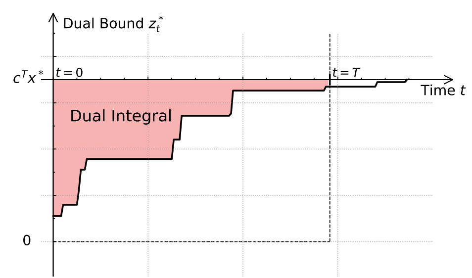

# Reinforcement Learning for Variable Selection in a Branch and Bound Algorithm (22)

 对原始的RL方法做了一些trick方面的优化，但与上一个有很大的不同     

## 传统方法
* strong-branch 略
* persudo-cost ： 

比如说当我们在有一些历史分支变量选择(min)时的记录，我们选择了在LP当中取值为$x_i$的变量,其分别可以取整为 $\lceil x_i \rceil$，$\lfloor x_i \rfloor$,相较于LP值，其带来的目标函数变化量为：
$$
PC_i^{+}=\frac{z_{0}-z_{up}}{ \lceil x \rceil -x_i}     \quad  PC_i^{-}=\frac{z_{0}-z_{up}}{ \lfloor x \rfloor -x_i}
$$

于是我选择预期目标变化量最大的变量进行分支：

$$
score_j= max(PC_i^{+}(\lceil x_i \rceil - x_i),PC_i^{-}( x_i - \lfloor x_i \rfloor ))
$$

由于不需要实际执行分支，所以成本会低很多，但是需要前期的好经验支持。

## 改进的强化学习

### RL设计（仍然传统）

* 状态 ：将节点按照 Gasse 等人提出的二分图来表示。
* 动作：即从$a \in A$中选择一个动作，a与变量x是一一对应的。

* 状态转移，$ p(s_{t+1}| s_t,a_t)$由节点选择策略$\pi$确定。

* 奖励：自上一个状态以来的对偶积分
$$
F(\tau)=\tau c^\tau x -\int_{t=0}^{\tau} z_t^* dt  \\
r(a_i|s_t)=F(t+1)-F(t)
$$

* 下一个状态：下一个B&B节点的二分图表示

* 终止标志当前episode 是否结束。

> 总之我们RL设计这一块并未看到它有什么非常创新的地方，总结一下就是传统的RL方法+ecole的状态表示方式。

### 训练框架（有所创新）

本框架有两个创新之处，其一在于引入了优势网络的设计，如下所示：
$$
\mathcal{L}(\theta) = 
\mathbb{E}\left[ \left( r + \gamma \max_{a'} Q^t(s', a'; \theta^t) - Q(s, a; \theta) \right)^2 \right] 
+ 
\mathbb{E}\left[ \left( Q^s(s, a; \theta^s) - Q(s, a; \theta) \right)^2 \right]
$$

于是现在一共就有了所谓的三个网络：

1. oline network:用于动作选择。

2. target network :用于动作价值评估。

3. superior network ：用于向高性能策略对齐。

其中前两个网络就是传统的时序差分，而最后一个网络是以结果为导向，是在检验当前策略的实际效果后，如果下过更好，那么就向当前策略对齐。

另一个创新之处是对经验回放缓存（实际就是常规cahce）做了一点处理：

* 首先收集一些非常优秀的训练数据加入到cache中（我个人呢推测可能是最优解或者SB）

* 若某段轨迹带来的回报超过一个阈值我就把其中的数据(1.e.四元组)加到cache中，用于以后学习。

* 数据依照lru更新，但是优秀预训练数据不会被移除。

## 效果

这种启发是的东西往往缺乏数学证明，只能看执行效果，作者认为是比较优秀的：

