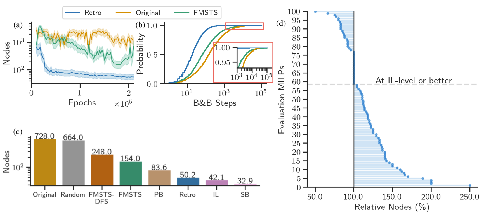

# 回溯轨迹作为RL学习样本 (22)

[论文链接](https://arxiv.org/pdf/2205.14345)

 本文的创新点非常tricky,几乎就是说明了我们可以重构出轨迹的片段作为训练的样本   

## 作者试图缓解的几个问题

作者提到，将RL用于分支定界的变量选择依然有以下几个问题：

1. 轨迹过长：学习过程中糟糕的决策会带来巨大的步数，可能会导致奖励稀疏，信用分配困难，以及回报方差过大。

2. 状态-动作空间庞大，难以学习其中的更优轨迹。

3. 部分可观测性。这是由于节点选择和变量选择本身是深度绑定的，但是写作该论文是节点与变量选择依然是分开的，导致变量选择时很难预测树的状态。

## 作者的解决办法

他认为说我们可以从一段现成的轨迹中还原出好的学习材料，而不必纠结于轨迹原本是如何生成的，如下图所示：

上图中蓝色和红色的点都是进行过节点选择的点（且一次节点选择前必然经过一次变量选择），其中红色的是被剪枝的节点。作者在这里随便采用了任意节点选择策略，得到左图轨迹。

然后从被剪枝节点出发，作者还原出*在同一个子树上的变量原则路径和决策路径*，即右图所示的四条路径。

### 为什么要这样做

首先，这样部分缓解了可观测性的问题：因为节点所在子树内的后续状态（如下界、新增约束等）与其当前状态高度相关，因此比从整棵搜索树其他位置跳转而来的状态更具可预测性和可观测性。

其次，由于重构的轨迹很碎片化，所以另外两个问题也有所缓解（似乎很trivial）。

### 关于RL的新东西

首先，奖励函数变成了尽量结束我这条路径（更快的剪枝）。因为选取的都是以剪枝为重点的路径，所以可以给每一步-1的奖励，给到达终点的一步0的奖励即可。

状态依然采用 Gasse二分图表示，节点选择采用的是SCIP默认策略，采用的强化学习方式也是传统的Q-learning。

### 实验效果

可以几个好处分别是：

1. a.收敛更快
2. b&c. 求解时节点比较少
3. 在42%的实例上超过了IL。

