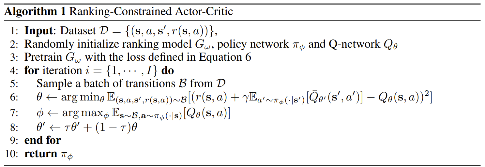

# LEARNING TO BRANCH WITH OFFLINE REINFORCEMENT LEARNING  (24)

 这篇文章的TOP-k思想还是比较有看点的。 

## 以往离线强化学习学习方法

### 问题

作者认为以往的某些offline （所谓offline,就是在学习过程中完全不能与环境进行交互，有别于20RL的off-policy）强化学习的一些问题：

1. 依赖非常昂贵的训练材料，比如说FSB这种昂贵的数据集。
2. 由于(r,s,a,s')难以在样本中完整覆盖,**因此传统Q-learning 可能会错误高估** 某些$Q(a|s)$,导致实际执行时的效果不好。

### 强化学习的基本框架

我们设定$Q^{\pi}(s,a)$为给定$\pi$下载s状态时动作a的价值，学习过程如下所示：

$$
\theta \leftarrow \arg\min_{\theta} \mathbb{E}_{(s,a,s')} \left[ \left( r(s, a) + \gamma \, \mathbb{E}_{a' \sim \pi_{\phi}(\cdot \mid s')} \left[ Q_{\theta'}(s', a') \right] - Q_{\theta}(s, a) \right)^2 \right]
$$

$$
\phi \leftarrow \arg\max_{\phi} \mathbb{E}_{s} \, \mathbb{E}_{a \sim \pi_{\phi}(\cdot \mid s)} \left[ Q_{\theta}(s, a) \right]
$$

但我们注意到我们对未出现的(s,a)估计$Q^{\pi}(s,a)$是不准确的，可能对OOD的情况产生过于乐观的估计，导致错误诱导$\pi$的生成。

## RCAC 算法

很简单，就是在传统的基础上加了一个topk的初步筛选过程，作者的初筛是根据(.|s)时不同a的对偶界改变量(i.e. $c^Tx^{LP}_{t+1}-c^Tx^{LP}_{t}$ )这一奖励函数来设定的。作者希望训练一个采样函数$G_{\omega}(a|s)$从而使对偶界改变更多的变量有更大的采样机会，如下：
$$
\arg \min_{\omega}
\;\mathbb{E}_{(s,a,r(s,a)) \sim \mathcal{D}}
\left[
-\big(\lambda \,\mathbf{1}_{r(s,a) > \zeta} + 1\big)
\log G_{\omega}(a \mid s)
\right]
$$

其中$\lambda $是我们给对偶界改进超过阈值$\zeta$的“好动作”的权重，
而$\zeta$一般设置为0，即能有对偶界的改进就说明它已经足够好了。另外，从该函数我们也可以发现它对“好动作”是一视同仁的，因此仅仅是发挥一个初筛作用。

经过初筛后脱颖而出的动作，我们给它$Q(a|s)$的估计，否则我们认为它是不可靠的，给它一个$-\delta$的惩罚，于是可以构造出$\bar{Q}$:

$$
\bar{Q}(s, a) =
\begin{cases}
Q(s, a), & \text{if } a \in \text{top-}k\!\left(G_{\omega}(a \mid s)\right), \\
-\delta, & \text{otherwise}.
\end{cases}
$$

于是作者就得到了经过初筛的Bellman方程迭代过程：
$$
\theta \leftarrow \arg \min_{\theta}
\;\mathbb{E}_{(s,a,s') \sim \mathcal{D}}
\left[
\left(
r(s,a)
+ \gamma \,\mathbb{E}_{a' \sim \pi_{\phi}(\cdot \mid s')}
\left[
\bar{Q}_{\theta'}(s', a')
\right]
- Q_{\theta}(s,a)
\right)^2
\right],
$$

$$
\phi \leftarrow \arg \max_{\phi}
\;\mathbb{E}_{s \sim \mathcal{D},\, a \sim \pi_{\phi}(\cdot \mid s)}
\left[
\bar{Q}_{\theta}(s, a)
\right].
$$
整个算法可总结为下：

## 实验效果

>在此之前需要指出状态同样也是通过二分图进行编码的(Gasse.2019)。

作者表示说我们即使不用最好的数据集去训练也能达到非常好的效果，他设计了以下三种数据集：

1. 标准 FSB：采用完全强分支的数据集。
2. 小 FSB:同上，但规模比较小。
3. VHB：5%的强分支+95%的伪成本分支构成。

显然的，后两种的生成成本更低，但是，它们的效果就非常差吗？

其实不然，即使在小规模 FSB（S）以及次优数据(H)上，RCAC也展现出了超过前人的计算效率。尤其是，它超过了RPB以及GGCN(IL)。

另外，作者在难以求解的巨大规模问题也求解了该问题，以给定求解时间的对偶界变化来说明它也具有比较优秀的性质：

作者最后进行了消融研究，证明了$G_{\omega}$确实足够强大，但是RCAC有助于进一步使它更强大。

 但似乎 $G_{\omega}$ 才是导致效果好的主要原因，而RL仅比$G_{\omega}$好一点点，这一点值得思考 

## 未来方向

我认为作者给出的3个建议都是比较有价值的：

* 考虑在线学习和离线学习结合。
* *深度*耦合求解器中的各个环节。
* 将这种top k思想用于其他环节。