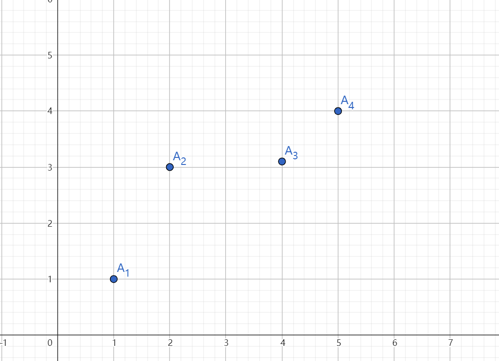
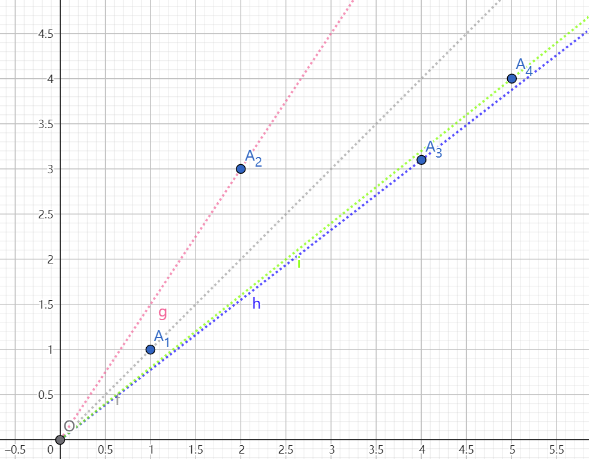

# Model-Based Pricing

## 动机确认

数据市场究竟应该**怎么卖**数据？

以往的传统操作方法：

* 直接售卖数据集：缺点在于买下相同数据集的价格是固定且高昂的，一些买家可能无法负担。从另一个角度，卖家的收益就少了。

* 售卖查询：缺点在于，仅仅售卖查询不足以让买家进行复杂的决策。

**以前训练模型的任务都是交给买家完成**，但事实上卖家（或者中间商）就可以做到这一步，之所以要直接卖模型，正是因为添加不同量模型的噪声对应不同的价值，这样我们就能对不同需求的买家收费(版本化)。

## 模型构建(案件还原)

### 线索1： $\delta \leftrightarrow \epsilon$

添加噪声必然使得模型输出变得不准（分类模型or回归模型），关键是如何刻画。文中我们可以简单得到如下关系：

Let \( \epsilon \) be convex as a function of the model instance \( h \).  
Let  

$$
\hat{h}^{\delta}_{\lambda}(D) = KG(h^{*}_{\lambda}(D), w).
$$  

Then, for any two parameters \(\delta_1, \delta_2\), we have  

$$
\mathbb{E}\big[ \epsilon(\hat{h}^{\delta_1}_{\lambda}(D), D) \big] 
\;\;\ge\;\; 
\mathbb{E}\big[ \epsilon(\hat{h}^{\delta_2}_{\lambda}(D), D) \big]
$$

**if and only if** \(\delta_1 \ge \delta_2\).  

If \(\epsilon\) is additionally **strictly convex**, the above holds with **strict inequality** (\(>\)).

### 线索2： $\epsilon \leftrightarrow p$

在（买家提供的）误差函数$\epsilon(.,.)$检验下，显然更低的误差意味着更高的价值，即：

$$
\mathbb{E}\big[ \epsilon(\hat{h}^{\delta_1}_{\lambda}(D), D) \big] 
\;\;\le\;\; 
\mathbb{E}\big[ \epsilon(\hat{h}^{\delta_2}_{\lambda}(D), D) \big]
$$  

**意味着**  

$$
p_{\epsilon,\lambda}(\delta_1, D) \;\;\ge\;\; p_{\epsilon,\lambda}(\delta_2, D).
$$

如果仅仅到此为止，这非常简单（我们可以让噪声越高的模型价格越低就可以），但关键就在于，***两个低价格，高噪声的模型，可能合成出一个低噪声的模型，其成本可能低于直接购买该模型***，即套利。

###关键推论：无套利条件

作者依据Cramer-Rao不等式（以及其他Fisher Information相关推论）提供的下界，证明了对于平方误差下无套利条件有这样的性质：
(1) If 

$$
\frac{1}{\delta_1} = \frac{1}{\delta_2} + \frac{1}{\delta_3},
$$  

then  

$$
p_{\epsilon^s,\lambda}(\delta_1, D) \;\;\le\;\; 
p_{\epsilon^s,\lambda}(\delta_2, D) + p_{\epsilon^s,\lambda}(\delta_3, D).
$$  

(2) If 
$$
\delta_1 \le \delta_2,
$$  

then  

$$
p_{\epsilon^s,\lambda}(\delta_1, D) \;\;\ge\;\; 
p_{\epsilon^s,\lambda}(\delta_2, D).
$$

简单记为：

$$
\overline{p}(x) \;=\; p_{\epsilon^s,\lambda} \left(\tfrac{1}{x}, D\right).
$$

满足次可加性和单调两个条件。

当然，平方误差只是一个特例，任何严格凸的误差函数，在$\delta$和$\epsilon$之间都构成双射，我们只需要构造一个逆函数

$$
\delta \;=\; \phi\!\left( \; \mathbb{E}\left[\, \epsilon \big(\hat{h}^{\delta}_{\lambda}(D), D \big) \,\right] \;\right).
$$

只要

$$
\overline{p}(x) \;=\; p_{\epsilon,\lambda}\left(\tfrac{1}{\phi(x)}, D\right).
$$

满足次可加性和单调两个条件就实现了无套利，**显然，对于平方误差，$\phi(x)\equiv x$**。

现在为止，我们真正建立了$\delta \leftrightarrow p$的约束关系。

## 简化并解决

### 原始问题分析

我们通过市场调研得到了不同买家对于不同质量模型的需求，那么问题实际上就是一个带约束的优化问题：

$$
\begin{aligned}
\max_{\hat{p}} \quad & T\big(\hat{p}(a_1), \ldots, \hat{p}(a_n)\big) \\
\text{subject to} \quad 
& \hat{p}(x+y) \leq \hat{p}(x) + \hat{p}(y), \quad x,y \geq 0, \\
& \hat{p}(y) \geq \hat{p}(x), \quad y \geq x \geq 0, \\
& \hat{p}(x) \geq 0, \quad x \geq 0.
\end{aligned}
$$

另外，我们容易发现求解最大收益实际上是一种次线性插值问题。然而，这是一个CO-NP问题。

>由于无界子集和问题是一个NP-hard问题，作者已经证明证明：当且仅当不存在值为 $K$ 的（无界）子集和时，才存在一个次可加且单调的函数能够插值这些点 $(a_j, P_j)$。

**我们往往可以近似解决或者解决一个相关问题，然后分析相关问题的精确解与原问题的解的关系，本文采用了后者。**

### 退一步讲

我们可以缩小搜索空间，将原问题缩小为如下问题（这里指的是下面问题的解满足原问题约束，反之不然）：

$$
\begin{align*}
\max \;& \hat{q}^T \big(\hat{q}(a_1), \dots, \hat{q}(a_n)\big) \\
\text{subject to } \;& \frac{\hat{q}(y)}{y} \le \frac{\hat{q}(x)}{x}, && y \ge x > 0, \\
& \hat{q}(y) \ge \hat{q}(x), && y \ge x \ge 0, \\
& \hat{q}(x) \ge 0, && x \ge 0.
\end{align*}
$$

***之所以要提出这个缩小版问题，有两个原因，第一个原因***，那就是他有与原问题最优相比优良的性质,当“小问题”有可行解$\hat{q}$时，原问题就有可行解$\hat{p}$,且

$$
\frac{\hat{p}(x)}{2} \le \hat{q}(x) \le \hat{p}(x)
$$

最重要的是***第二个***原因：***该问题多项式时间内可解***

在解决最终问题前，我们可以首先把这个“小”问题再简化一下，从函数的关系直接到点的关系（等价性证明略）：

$$
\begin{align*}
\max \;& T(z_1, \dots, z_n) \\
\text{subject to } \;& \frac{z_j}{a_j} \le \frac{z_i}{a_i}, && a_j \ge a_i, \\
& z_j \ge z_i, && a_j \ge a_i, \\
& z_j \ge 0, && 1 \le j \le n.
\end{align*}
$$

###最后一块拼图——动态规划求解

作者的动态规划颇为奇怪，但我们最终一定能够拨云见日。

比如下面只有4个点的情况，假设从$A_1$到$A_4$每个点的权重(人数)分别为2,3,4,1。

简单证明可知，我们在每一个x下最优定价必然会出现在斜率约束处或者单调约束处。***由于本论文出现的所有点默认就是满足单调性约束的***（这是相对合理的，因为人们往往会对高精度产品做出高估值，尤其是在信息差很小的情况），那么，我们的所有约束其实就是斜率约束。

如下所示，我们做出约束线：

按照斜率从大到小我们可以编号为$l_1,l_2,...,l_4$，斜率可以编号为$\Delta_1,\Delta_2,...,\Delta_4$,需要注意的是，斜率的编号与点的编号是不对应的。

我们的动态规划是从最后一个点开始的，比如说一共有m个点，其中$OPT(t,\Delta_i)$指的就是，考虑到第$t,t+1,...,m$个点，且所有定价点都在l_i这条线下方的定价的最优解（数值上）。一个***关键点在于***，当i<j时，$OPT(t,\Delta_i) \leq OPT(t,\Delta_j)$。

我们从最后一个点（也就是第4个点）开始看，显然$OPT(4,\Delta_1)=OPT(4,\Delta_2)=OPT(4,\Delta_3)=v4$,$OPT(4,\Delta_3)=\Delta_3 \times v_4$。

显然我们回到倒数第二个点（也就是第3个点）开始看，这时由于$l_1,l_2,l_3$都在$A_3$上方了，那就意味着$OPT(3,\Delta_1)$(或2,3)要取到的最大值必然是$OPT(3,\Delta_4)$和$OPT(4,\Delta_1)$（或2,3）中的最大的一个。思考如下：此处的点可能与后面的点不兼容，也可能兼容，那么当i<j时，$(3,\Delta_i)$兼容的
一定会在$(3,\Delta_j)$处兼容；当不兼容出现时，比如此时$OPT(3,\Delta_1)$也可以抛弃掉该点，因此$OPT(3,\Delta_1)$必定是$OPT(3,\Delta_4)$和$OPT(3,\Delta_1)$的较大者，对于$OPT(3,\Delta_1)$,自然就是
$4v3+\Delta_3×v_4$

以此更新OPT最终更新到$OPT(1,\Delta_1)$,我们就找到了最优解。

>不是很方便描述，具体还是得看原文最后一页

#回顾梳理

据我的回忆，机制执行过程简单概括如下：

1. 中间人市场调查，得到模型需求，得到一个噪声-价值的点对的集合。
2. 利用动态规划计算最优价格。
3. 一手交钱，一手交货。

