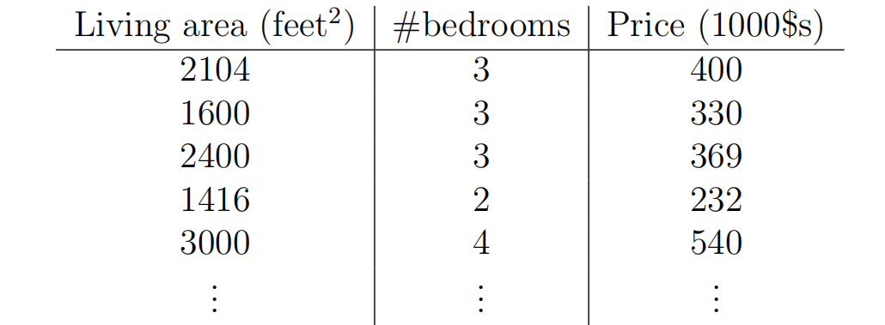
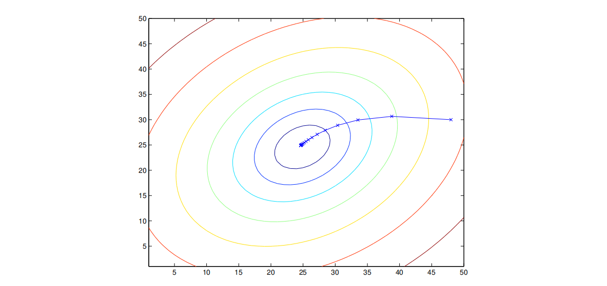
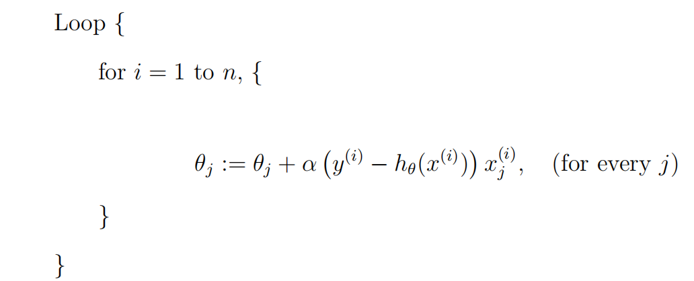
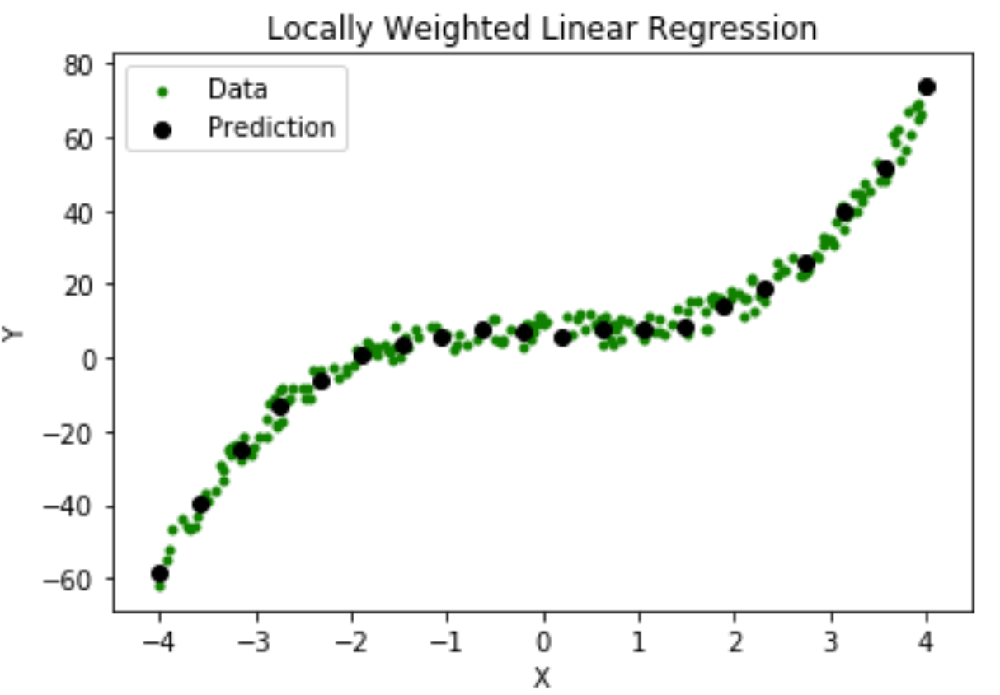

# 第一章

## 基本定义
$x^{(i)}$：输入变量

$y^{(i)}$:输出变量；或者叫做目标变量

$(x^{(i)} ,y^{(i)})$:训练样例

n个训练样例的列表：$\{(x^{(i)} ,y^{(i)});i=1,2,...,n\}$称为训练集

$\mathcal{X},\mathcal{Y}$:输入空间，输出空间

h:监督学习(supervised learning)的目标，即一个函数:$\mathcal{X}\mapsto \mathcal{Y}$,使得给定x能够较好地预测到y。

regression problem:学习问题中目标变量是连续变量的。

calssification problem:目标变量(y)是离散的。

### 线性回归

比如对于上面这张图，我们采取：
$$
h_\theta(x)=\theta_0+\theta_1 x_1+\theta_2 x_2
$$

这里的$\theta$称为parameter或者weights。为了方便表示，可以令$x_0=1$,实际上就是消除它乘上$\theta_0$的影响，因此有：
$$
h(x)=\sum_{i=0}^{d} \theta_i x_i=\theta^T x
$$
即将其视为向量内积，d表示维度。

---
**一个重要的问题是：我们如何找到合理的h呢？**

我们可以认为一个好的h总能使$h(x^{(i)})$接近对应的$y_i$，那么应该如何衡量呢？比如有下面一种衡量方式：

$$
J(\theta) = \frac{1}{2} \sum_{i=1}^{n} \left( h_\theta(x^{(i)}) - y^{(i)} \right)^2
$$

## LMS方法

前面已经定义了一个损失函数（最小二乘损失函数），我们优化的过程当然就希望优化这个损失函数——沿着损失函数梯度的反方向优化自然是一种不错的方法，所以有：
$$
\theta_j := \theta_j - \alpha \frac{\partial}{\partial \theta_j} J(\theta)
$$

带入前面对$J(\theta)$的定义中，我们自然就能得到对于只有1个训练样本的情况，更新规则为：
$$
\theta_j := \theta_j + \alpha \left( y^{(i)} - h_\theta(x^{(i)}) \right) x_j^{(i)}
$$

对于有n个样本的情况：
$$
\theta_j := \theta_j + \alpha \sum_{i=1}^{n} \left( y^{(i)} - h_\theta(x^{(i)}) \right) x_j^{(i)}
$$

其中j=0,1，...,d。每一轮需要依据所有样本更新直到收敛。

>  This method looks
at every example in the entire training set on every step, and is called batch
gradient descent.

由于我们定义的损失函数是一个**凸二次函数**，局部最优解就是全局最优解，所以可以避免进入局部最优解。

上图就表示了一个收敛轨迹（圈圈是等高线）

---

当然也可以规定一个处理顺序来扫描到一组数据就进行及时地更新，而不必等到全部扫描完一遍再更新，前者叫随机梯度下降(stochastic gradient descent),后者叫batch gradient descent。前者如下：

## The normal equations

也可以直接显式求解

对于一个函数 $ f : \mathbb{R}^{n \times d} \to \mathbb{R} $，它将 $ n \times d $ 的矩阵映射为实数，我们定义 $ f $ 关于矩阵 $ A $ 的导数为：

$$
\nabla_A f(A) =
\begin{bmatrix}
\frac{\partial f}{\partial A_{11}} & \cdots & \frac{\partial f}{\partial A_{1d}} \\
\vdots & \ddots & \vdots \\
\frac{\partial f}{\partial A_{n1}} & \cdots & \frac{\partial f}{\partial A_{nd}}
\end{bmatrix}
$$

可见求导之后与A是同尺寸的矩阵。

---

定义一个设计矩阵，大小为$n \times d$(如果考虑截距项则为$n \times d+1$)。我们可以把所有x的向量放进去，如下所示：

$$
X =
\begin{bmatrix}
— & (x^{(1)})^T & — \\
— & (x^{(2)})^T & — \\
    & \vdots & \\
— & (x^{(n)})^T & — \\
\end{bmatrix}
$$

同样所有y也可以放到一个$n \times 1$矩阵：
$$
\vec{y} =
\begin{bmatrix}
y^{(1)} \\
y^{(2)} \\
\vdots \\
y^{(n)}
\end{bmatrix}
$$

那么我们就可以把估计与实际的差值表示在矩阵中：

$$
X\theta - \vec{y} =
\begin{bmatrix}
(x^{(1)})^T \theta \\
\vdots \\
(x^{(n)})^T \theta
\end{bmatrix}
-
\begin{bmatrix}
y^{(1)} \\
\vdots \\
y^{(n)}
\end{bmatrix}
=
\begin{bmatrix}
h_\theta(x^{(1)}) - y^{(1)} \\
\vdots \\
h_\theta(x^{(n)}) - y^{(n)}
\end{bmatrix}
$$

进一步可以表示出$J(\theta)$,
$$
\frac{1}{2} (X\theta - \vec{y})^T (X\theta - \vec{y}) = \frac{1}{2} \sum_{i=1}^{n} (h_\theta(x^{(i)}) - y^{(i)})^2 = J(\theta)
$$
甚至可以表示出梯度：
$$
\nabla_{\theta} J(\theta)=X^TX\theta-X^T\vec{y}
$$

我们直接令方程为0，可以表示出$\theta$:
$$
\theta = (X^T X)^{-1} X^T \vec{y}
$$

## 最大似然估计（MLE）与最小二乘关系

所谓概率，就是根据**一些现实中的参数去推测某个未知事件（或参数）的发生情况分布**；反之，似然就是指**从已经发生的事情推断现实中的参数的分布**。

***在这里，比如说给定$\theta$时，由于受到噪声影响，我们会有一个y的分布；但反过来，如果我们已经知道y的结果，我们就希望找到什么样$\theta$会导致这样的结果。***

具体而言，比如说满足
$$
y^{(i)} = \theta^T x^{(i)} + \epsilon^{(i)}, \quad \text{其中} \quad \epsilon^{(i)} \sim \mathcal{N}(0, \sigma^2)
$$

我们可以写出$\epsilon^{(i)}$的密度函数：
$$
p(\epsilon^{(i)}) = \frac{1}{\sqrt{2\pi}\sigma} \exp\left(-\frac{(\epsilon^{(i)})^2}{2\sigma^2}\right)
$$
这表明：
$$
p(y^{(i)} \mid x^{(i)}; \theta) = \frac{1}{\sqrt{2\pi}\sigma} \exp\left(-\frac{(y^{(i)} - \theta^T x^{(i)})^2}{2\sigma^2}\right)
$$
因为这实际上就是一个简单的平移关系

我们可以按照本节最开始的思路进行视角变换（将一个以y的参数的函数重新视为以$\theta$为参数的函数）：
$$
L(\theta) = L(\theta; X, \vec{y}) = p(\vec{y} \mid X; \theta)
$$

为了找到最合理的$\theta$,我们实际上就是希望最大化这个函数，
展开过程不费口舌描述，总之最大化$L(\theta)$的目标与最大化其对数一致，而实际上就是最大化

$$
- \sum_{i=1}^{n} (y^{(i)} - \theta^T x^{(i)})^2
$$

我们看到最小二乘回归实际上就是在执行最大似然估计。

## 局部加权线性回归

它是一种非参数算法（每次拟合都需要重新根据查询点周围情况调整权重）

比如在上图中绿色点就是训练点，黑色点就是预测点。我们实际上就是赋予离预测点较近的训练点更高的权重：

最小化：
$$ 
\sum_i w^{(i)} (y^{(i)} - \theta^T x^{(i)})^2
$$

往往w取：
$$
w^{(i)} = \exp\left(-\frac{(x^{(i)} - x)^2}{2\tau^2}\right)
$$

其中$\tau$控制权重随距离增加的衰减速度。

ps:前面的LMS方法作为线性方法，训练完成后只需要保留$\theta$即可，而现在的这种非参数方法需要保留训练数据。
